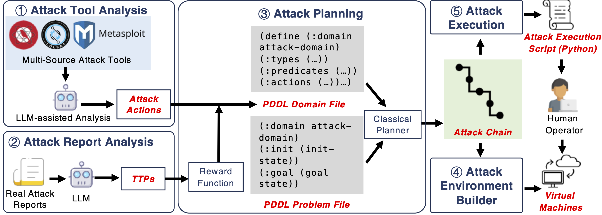

# Introduction
<p><a href="https://arxiv.org/pdf/2407.16928"></a></p>

- Aurora automatically creates cyberattacks using third-party tools and mimics real-world attackers by analyzing threat intelligence reports.

- We designed a modular system(Attack Action Linking Model , AALM) to organize attack steps and combined classical planning with LLM to solve challenges in building multi-step attacks.
  
- Experiments proved Aurora generates higher-quality and more diverse attack chains than existing tools or cutting-edge AI models.
 
- We published the first large-scale, automatically generated dataset with 1,000+ attack chains, including scripts and environments.
  
Our paper: [From Sands to Mansions: Towards Automated Cyberattack Emulation with Classical Planning and Large Language Models](https://arxiv.org/pdf/2407.16928)


# System Overview

<p align="center">



</p>

Aurora’s architecture comprises five components:

- Attack Tool Analyzer: Converts third-party tool documentation into structured attack actions using rule-based and LLM-assisted predicate extraction.

- Attack Report Analyzer: Extracts Tactics, Techniques, and Procedures (TTPs) from CTI reports via LLMs to guide attack planning.

- Attack Planning: Uses PDDL and reward functions (aligned with CTI-derived TTPs) to generate attack chains.

- Attack Environment Builder: Deploys pre-configured virtual machines to replicate vulnerable environments.

- Attack Execution and Data Collection: Semi-automatically runs attack scripts and collects traces for dataset construction.

# Attack Demos

## Attack chains
This [folder](https://github.com/LexusWang/Aurora-demos/tree/main/examples) stores attack chains generated by Aurora. Each folder in `examples` contains an attach chain, which includes the emulation plan details and attack steps.

For more details, please refer to the [introduction to attack chains](https://github.com/LexusWang/Aurora-demos/blob/main/docs/attack_chain_introduction.md).

## Infrastructure Download
Use the generated attack chain YML file and run `pull.py` to automatically download and deploy the corresponding virtual machine environment (works with VirtualBox; VMware users can manually deploy the downloaded files).
Two download modes are supported:

No duplicate downloads: If the file already exists, it will prompt whether to directly proceed with deployment.

Allow duplicate downloads: Files will be automatically renamed to avoid conflicts.

During initial deployment (including repeated deployments), the VM will not start automatically, allowing users to modify configurations.

By default, two network adapters will be configured: one in NAT mode and the other in Host-only mode. Make sure the required network is configured in VirtualBox; otherwise, the VM may fail to start.

``` bash
## Prohibiting duplicate deployment
python pull.py -p #yml_file_path -d #storage_path -vm #VBoxManage.exe_path --url_table #url_table_path -nr -firewall #yes/no
## Allowing duplicate downloads
python pull.py -p #yml_file_path -d #storage_path -vm #VBoxManage.exe_path --url_table #url_table_path -r -firewall #yes/no
```
- `yml_file_path`：The path of the attack chain yml file  
- `storage_path`：The storage path of the downloaded target machine file  
- `VBoxManage.exe_path`：The VBoxManage.exe path of VirtualBox is used for invocation  
- `url_table_path`：The path of the Download Link mapping table (url_table.csv)  
- `-nr`：Prohibiting duplicate deployment  
- `-r`：Allowing duplicate downloads  
- `-firewall`：Use pfSense firewall to isolate the attack aircraft and the target aircraft

[Here](https://github.com/LexusWang/Aurora-demos/blob/main/docs/environment_introduction.md) detailed multiple victim machine ,you can customize based on your needs.

## Emulation Topology
<p align="center">
  
</p>

If you want to set up a more realistic attack environment, this [doc](https://github.com/LexusWang/Aurora-demos/blob/main/docs/Emulation_Infrastructure_info.md) outlines a network topology with attacker and victim setups, including firewalls and DNS_servers to better mimic real-world attack scenarios. Just follow the guide to configure your environment! we’ve also got a pre-configured Kali attack machine ready for you! You can download it directly from [here](https://drive.google.com/file/d/1FCBZtsHM363eWor1xep4CzfNtMSio-RS/view?usp=drive_link).

## Script Execution
We've generated executable attack scripts with AURORA and placed them in [here](https://github.com/LexusWang/Aurora-demos/tree/main/attack_execution_scripts) .Once your environment is configured, simply open the console, run the scripts, and follow the on-screen instructions to execute the attack.

```bash
python ../results/execution_xxxx.py
```
Click the following headings for details:
<details>
<summary>EXAMPLE-1_execution_keyboard_input_simulated-3</summary>

This attack plan uses `Metasploit` and `Sliver` tools to compromise Windows systems. First, a listener is established to capture incoming connections. A malicious `Sliver` payload is then created and delivered by tricking the victim into downloading/running it, granting remote access. Finally, this access is leveraged to deploy a stealthy `Meterpreter` payload via `Sliver` for data exfiltration (`keyboard input simulation`).

<p align="center">
  
</p>

</details>

<details>
<summary>EXAMPLE-2_execution_file_info_known-1</summary>

This attack simulation targets Windows systems using `Sliver` and `Metasploit`. It starts by creating a `Sliver` implant (malicious.exe) and tricking the victim into downloading/running it as Administrator. This grants attackers an elevated `Sliver` C2 session. Next, a `Metasploit` listener is set up to catch a reverse HTTPS payload ("meterpreter_reverse_http") deployed through `Sliver`, enabling a stealthy `Meterpreter` session. Finally, attackers use `Meterpreter` to search for sensitive files (like *.txt) on compromised machines.

<p align="center">
  
</p>
</details>


**_Licensing_**
```
This project is open-source and distributed under the MIT. You are free to use, modify, and distribute the software for any purpose.  
```

